# Diagramas del Proyecto - CV Builder con IA

## 1. Diagrama de Casos de Uso

### Actores del Sistema

| Actor | Descripción |
|-------|-------------|
| **Usuario** | Persona que crea y gestiona su hoja de vida |
| **Sistema IA** | Motor de OpenAI que provee funcionalidades de IA |
| **Sistema PDF** | Generador de PDFs usando Puppeteer |

### Casos de Uso (26 en total)

| ID | Caso de Uso | Actor |
|----|-------------|-------|
| UC-01 | Crear CV | Usuario |
| UC-02 | Editar CV | Usuario |
| UC-03 | Eliminar CV | Usuario |
| UC-04 | Listar CVs | Usuario |
| UC-05 | Ver CV | Usuario |
| UC-06 | Seleccionar Plantilla | Usuario |
| UC-07 | Ingresar Datos Personales | Usuario |
| UC-08 | Agregar Resumen Profesional | Usuario |
| UC-09 | Agregar Links (LinkedIn/Portfolio) | Usuario |
| UC-10 | Agregar Experiencia | Usuario |
| UC-11 | Editar Experiencia | Usuario |
| UC-12 | Eliminar Experiencia | Usuario |
| UC-13 | Indicar Trabajo Actual | Usuario |
| UC-14 | Agregar Educación | Usuario |
| UC-15 | Editar Educación | Usuario |
| UC-16 | Eliminar Educación | Usuario |
| UC-17 | Agregar Habilidades | Usuario |
| UC-18 | Remover Habilidades | Usuario |
| UC-19 | Optimizar Contenido | Usuario → Sistema IA |
| UC-20 | Sugerir Habilidades | Usuario → Sistema IA |
| UC-21 | Match con Oferta Laboral | Usuario → Sistema IA |
| UC-22 | Obtener Consejos de Entrevista | Usuario → Sistema IA |
| UC-23 | Aplicar Sugerencias | Usuario |
| UC-24 | Generar PDF | Usuario → Sistema PDF |
| UC-25 | Descargar PDF | Usuario |
| UC-26 | Previsualizar PDF | Usuario |

### Código Mermaid - Casos de Uso

```mermaid
%%{ init: { "theme": "default", "flowchart": { "curve": "linear" } } }%%
flowchart TB
    subgraph USUARIO["ACTOR: USUARIO"]
        direction TB
        UC1["Crear CV"]
        UC2["Editar CV"]
        UC3["Eliminar CV"]
        UC4["Listar CVs"]
        UC5["Ver CV"]
        UC6["Seleccionar Plantilla"]
        UC7["Ingresar Datos Personales"]
        UC8["Agregar Resumen"]
        UC9["Agregar Links"]
        UC10["Agregar Experiencia"]
        UC11["Editar Experiencia"]
        UC12["Eliminar Experiencia"]
        UC13["Indicar Trabajo Actual"]
        UC14["Agregar Educación"]
        UC15["Editar Educación"]
        UC16["Eliminar Educación"]
        UC17["Agregar Habilidades"]
        UC18["Remover Habilidades"]
        UC19["Optimizar Contenido"]
        UC20["Sugerir Habilidades"]
        UC21["Match con Oferta"]
        UC22["Consejos de Entrevista"]
        UC23["Aplicar Sugerencias"]
        UC24["Generar PDF"]
        UC25["Descargar PDF"]
        UC26["Previsualizar PDF"]
    end
    
    subgraph IA["ACTOR: SISTEMA IA"]
        IA1["Optimizar Contenido"]
        IA2["Sugerir Habilidades"]
        IA3["Match con Oferta"]
        IA4["Generar Consejos"]
    end
    
    subgraph PDF["ACTOR: SISTEMA PDF"]
        PDF1["Generar PDF"]
        PDF2["Previsualizar PDF"]
    end
    
    subgraph BD["ACTOR: BASE DE DATOS"]
        BD1["Almacenar CV"]
        BD2["Recuperar CV"]
        BD3["Actualizar CV"]
        BD4["Eliminar CV"]
    end
    
    USUARIO --> UC1
    USUARIO --> UC2
    USUARIO --> UC3
    USUARIO --> UC4
    USUARIO --> UC5
    USUARIO --> UC6
    USUARIO --> UC7
    USUARIO --> UC8
    USUARIO --> UC9
    USUARIO --> UC10
    USUARIO --> UC11
    USUARIO --> UC12
    USUARIO --> UC13
    USUARIO --> UC14
    USUARIO --> UC15
    USUARIO --> UC16
    USUARIO --> UC17
    USUARIO --> UC18
    USUARIO --> UC19
    USUARIO --> UC20
    USUARIO --> UC21
    USUARIO --> UC22
    USUARIO --> UC23
    USUARIO --> UC24
    USUARIO --> UC25
    USUARIO --> UC26
    
    UC19 --> IA1
    UC20 --> IA2
    UC21 --> IA3
    UC22 --> IA4
    UC23 --> UC2
    
    UC24 --> PDF1
    UC26 --> PDF2
    
    UC1 --> BD1
    UC2 --> BD3
    UC3 --> BD4
    UC4 --> BD2
    UC5 --> BD2
    
    style USUARIO fill:#e3f2fd,stroke:#1976d2,stroke-width:2px
    style IA fill:#f3e5f5,stroke:#7b1fa2,stroke-width:2px
    style PDF fill:#e8f5e9,stroke:#388e3c,stroke-width:2px
    style BD fill:#fff3e0,stroke:#f57c00,stroke-width:2px
```



---

## 2. Diagrama de Clases

### Entidades Principales

```typescript
// Entidad: Resume (Hoja de Vida)
class Resume {
  - id: string
  - userId: string
  - personalInfo: PersonalInfo
  - experience: Experience[]
  - education: Education[]
  - skills: string[]
  - templateId: string
  - createdAt: Date
  - updatedAt: Date
  + create(): Resume
  + update(): Resume
  + delete(): void
  + generatePDF(): PDF
}

// Value Object: PersonalInfo
class PersonalInfo {
  - name: string
  - email: string
  - phone?: string
  - location?: string
  - linkedin?: string
  - portfolio?: string
  - summary?: string
}

// Entity: Experience (Experiencia Laboral)
class Experience {
  - id: string
  - company: string
  - position: string
  - startDate: string
  - endDate?: string
  - current: boolean
  - description: string
}

// Entity: Education (Educación)
class Education {
  - id: string
  - institution: string
  - degree: string
  - field: string
  - startDate: string
  - endDate?: string
  - gpa?: string
}

// Entity: User (Usuario)
class User {
  - id: string
  - email: string
  - name?: string
  - createdAt: Date
  + createCV(): Resume
  + listCVs(): Resume[]
}

// Entity: Template (Plantilla)
class Template {
  - id: string
  - name: string
  - description?: string
  - thumbnail?: string
  - isPremium: boolean
}
```

### Interfaces (Repositorios)

```typescript
interface IResumeRepository {
  + create(data: CreateResumeDTO): Promise<Resume>
  + findById(id: string): Promise<Resume | null>
  + findByUserId(userId: string): Promise<Resume[]>
  + update(id: string, data: UpdateResumeDTO): Promise<Resume>
  + delete(id: string): Promise<void>
}

interface IAIProvider {
  + optimizeContent(request: AITextOptimizationRequest): Promise<AITextOptimizationResponse>
  + suggestSkills(request: AISkillsSuggestionRequest): Promise<AISkillsSuggestionResponse>
  + matchJob(request: AIJobMatchRequest): Promise<AIJobMatchResponse>
  + getInterviewTips(request: AIInterviewTipsRequest): Promise<AIInterviewTipsResponse>
}

interface IPDFGenerator {
  + generate(request: PDFGenerateRequest): Promise<PDFGenerateResponse>
  + getTemplates(): PDFTemplate[]
}
```

### Casos de Uso (Application Layer)

```typescript
class CreateResumeUseCase {
  - resumeRepository: IResumeRepository
  + execute(data: CreateResumeDTO): Promise<Resume>
}

class UpdateResumeUseCase {
  - resumeRepository: IResumeRepository
  + execute(id: string, data: UpdateResumeDTO): Promise<Resume>
}

class GetResumeUseCase {
  - resumeRepository: IResumeRepository
  + execute(id: string): Promise<Resume>
  + getByUserId(userId: string): Promise<Resume[]>
}

class DeleteResumeUseCase {
  - resumeRepository: IResumeRepository
  + execute(id: string): Promise<void>
}

class OptimizeWithAIUseCase {
  - aiProvider: IAIProvider
  + execute(request: AITextOptimizationRequest): Promise<AITextOptimizationResponse>
}

class SuggestSkillsUseCase {
  - aiProvider: IAIProvider
  + execute(request: AISkillsSuggestionRequest): Promise<AISkillsSuggestionResponse>
}

class GeneratePDFUseCase {
  - pdfGenerator: IPDFGenerator
  + execute(request: PDFGenerateRequest): Promise<PDFGenerateResponse>
}
```

### Servicios de IA

```typescript
class ContentOptimizerService implements IAIProvider {
  - openai: OpenAI
  + optimizeContent(request: AITextOptimizationRequest): Promise<AITextOptimizationResponse>
}

class SkillsSuggestionsService implements IAIProvider {
  - openai: OpenAI
  + suggestSkills(request: AISkillsSuggestionRequest): Promise<AISkillsSuggestionResponse>
}

class JobMatcherService implements IAIProvider {
  - openai: OpenAI
  + matchJob(request: AIJobMatchRequest): Promise<AIJobMatchResponse>
}

class InterviewTipsService implements IAIProvider {
  - openai: OpenAI
  + getInterviewTips(request: AIInterviewTipsRequest): Promise<AIInterviewTipsResponse>
}
```

### Código Mermaid - Diagrama de Clases

```mermaid
classDiagram
    %% Entidades
    class User {
        +string id
        +string email
        +string? name
        +Date createdAt
        +createCV() Resume
        +listCVs() Resume[]
    }
    
    class Resume {
        +string id
        +string userId
        +PersonalInfo personalInfo
        +Experience[] experience
        +Education[] education
        +string[] skills
        +string templateId
        +Date createdAt
        +Date updatedAt
        +create() Resume
        +update() Resume
        +delete() void
        +generatePDF() PDF
    }
    
    class Template {
        +string id
        +string name
        +string? description
        +string? thumbnail
        +bool isPremium
    }
    
    class PersonalInfo {
        +string name
        +string email
        +string? phone
        +string? location
        +string? linkedin
        +string? portfolio
        +string? summary
    }
    
    class Experience {
        +string id
        +string company
        +string position
        +string startDate
        +string? endDate
        +bool current
        +string description
    }
    
    class Education {
        +string id
        +string institution
        +string degree
        +string field
        +string startDate
        +string? endDate
        +string? gpa
    }
    
    %% Interfaces
    class IResumeRepository {
        <<interface>>
        +create(data) Promise~Resume~
        +findById(id) Promise~Resume~
        +findByUserId(userId) Promise~Resume[]~
        +update(id, data) Promise~Resume~
        +delete(id) Promise~void~
    }
    
    class IAIProvider {
        <<interface>>
        +optimizeContent(request) Promise~Response~
        +suggestSkills(request) Promise~Response~
        +matchJob(request) Promise~Response~
        +getInterviewTips(request) Promise~Response~
    }
    
    class IPDFGenerator {
        <<interface>>
        +generate(request) Promise~Response~
        +getTemplates() Template[]
    }
    
    %% Implementaciones
    class PrismaResumeRepository implements IResumeRepository {
        -prisma: PrismaClient
        +create(data) Promise~Resume~
        +findById(id) Promise~Resume~
        +findByUserId(userId) Promise~Resume[]~
        +update(id, data) Promise~Resume~
        +delete(id) Promise~void~
    }
    
    class ContentOptimizerService {
        -openai: OpenAI
        +optimizeContent(request) Promise~Response~
    }
    
    class SkillsSuggestionsService {
        -openai: OpenAI
        +suggestSkills(request) Promise~Response~
    }
    
    class JobMatcherService {
        -openai: OpenAI
        +matchJob(request) Promise~Response~
    }
    
    class InterviewTipsService {
        -openai: OpenAI
        +getInterviewTips(request) Promise~Response~
    }
    
    class PDFGeneratorService {
        -browser: Browser
        +generate(request) Promise~Response~
        +getTemplates() Template[]
    }
    
    %% Relaciones
    User "1" --> "*" Resume : tiene
    Resume "1" --> "1" Template : usa
    Resume "1" --> "1" PersonalInfo : tiene
    Resume "*" --> "*" Experience : tiene
    Resume "*" --> "*" Education : tiene
    
    PrismaResumeRepository ..> IResumeRepository
    ContentOptimizerService ..> IAIProvider
    SkillsSuggestionsService ..> IAIProvider
    JobMatcherService ..> IAIProvider
    InterviewTipsService ..> IAIProvider
    PDFGeneratorService ..> IPDFGenerator
```



---

## 3. Resumen de Diagramas

| Diagrama | Propósito | Código Mermaid |
|----------|-----------|----------------|
| **Casos de Uso** | 26 funcionalidades del sistema | ✓ Incluido |
| **Clases** | Entidades, interfaces, implementaciones | ✓ Incluido |

### Cómo Usar

1. Copia el código Mermaid en [Mermaid Live Editor](https://mermaid.live/)
2. El diagrama se generará automáticamente
3. Descárgalo como imagen para tus presentaciones

### Colores Recomendados (para manualmente)

| Elemento | Color |
|----------|-------|
| Usuario | Azul (#1976d2) |
| Sistema IA | Morado (#7b1fa2) |
| Sistema PDF | Verde (#388e3c) |
| Base de Datos | Naranja (#f57c00) |
| Entidades | Gris (#424242) |
| Interfaces | Amarillo (#fbc02d) |
| Servicios | Azul claro (#0288d1) |